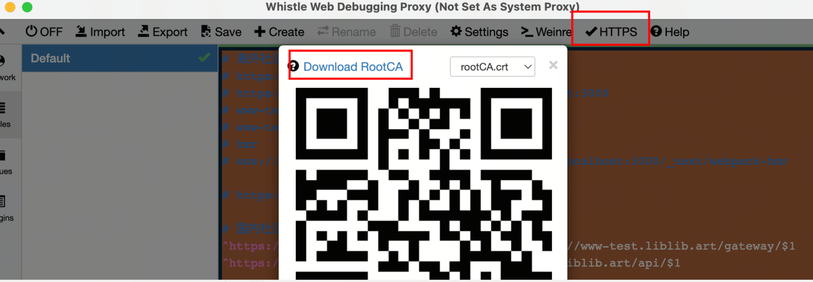

### 下载whistle，配置根目录证书

https://github.com/avwo/whistle-client/releases

1. 下载https根目录证书
    

1. 点击证书设置钥匙串为可信任
    
.png)

3. 配置rule
    
.png)

其中https://www-test.liblib.art [http://127.0.0.1:3004](http://127.0.0.1:3004) 改成自己应用的端口

### 2、下载扩展插件

[插件下载地址](https://chromewebstore.google.com/detail/proxy-switchyomega-3-zero/pfnededegaaopdmhkdmcofjmoldfiped?hl=zh-CN)

打开扩展插件，固定在浏览器的搜索栏右侧

点击蓝色圆圈，选择proxy，再点击选项配置进入配置
.png)

### 3、最后代理成功

请求https://www-test.liblib.art即可打开本地代码

  

## 使用更新

### Q1 如果遇到配置代理后，所有网页都走了代理的情况可设置auto switch，并选择该模式

配置如下.png)